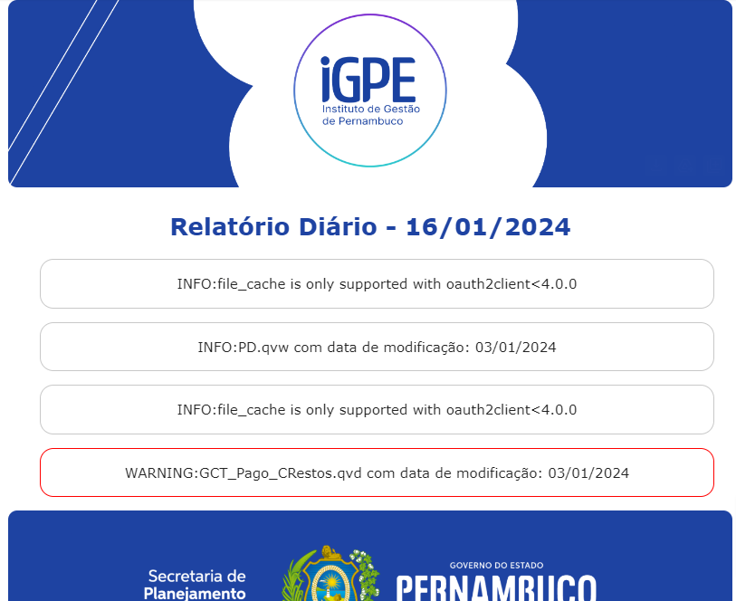

## REPORT MAIL SEPLAG

Tarefa que envia emails dado um arquivo de log no formato txt.

O script lê o log, filtra pela última data e envia para emails armazenados em um .env

### Template de log:
*DATE:LOG TYPE:LOG TEXT*

> #### 2024-01-05 16:47:26,371:INFO:file_cache is only supported with oauth2client<4.0.0
> #### 2024-01-05 16:47:27,420:WARNING:GCT_Pago_CRestos.qvd com data de modificação: 03/01/2024

### Esse template é necessário para destacamento dos Warnings


### Usando linha de comando

Necessário passar dois parâmetros: 

* *project_name*: O nome do projeto que irá no nome do assunto do email.
* *log_file*: Arquivo de log que será enviado.

Exemplo, na raiz do projeto executar o comando:

```bash
python main.py --project_name='Projeto X' --log_file='/home/user/logs/logfile.txt'
```